// Enable keyboard shortcuts
:experimental:

:toc: macro
:toc-title: Summary
:toclevels: 3
:numbered:

ifndef::env-github[:icons: font]
ifdef::env-github[]
:status:
:outfilesuffix: .adoc
:caution-caption: :fire:
:important-caption: :exclamation:
:note-caption: :paperclip:
:tip-caption: :bulb:
:warning-caption: :warning:
endif::[]

:back_to_top_target: top-target
:back_to_top_label: ⬆ Back to top
:back_to_top: <<{back_to_top_target},{back_to_top_label}>>

:main_title: Excel Editor API
:git_project_base: excel-editor
:git_project_api: {git_project_base}-api
:git_project_spa: {git_project_base}-spa
:git_project_insomnia: {git_project_base}-insomnia
:git_username: jprivet-dev
:git_url_api: https://github.com/{git_username}/{git_project_api}
:git_url_api_data: {git_url_api}/tree/main/data
:git_url_spa: https://github.com/{git_username}/{git_project_spa}
:git_url_insomnia: https://github.com/{git_username}/{git_project_insomnia}
:git_ssh_api: git@github.com:{git_username}/{git_project_api}
:git_ssh_spa: git@github.com:{git_username}/{git_project_spa}
:git_clone_ssh_api: git@github.com:{git_username}/{git_project_api}.git
:git_clone_ssh_spa: git@github.com:{git_username}/{git_project_spa}.git

:git_project_current: {git_project_api}
:git_url_current: {git_url_api}
:git_ssh_current: {git_ssh_api}

:codacy_project_settings_coverage: https://app.codacy.com/gh/{git_username}/{git_project_api}/settings/coverage

// Releases
:project_release: v1.1.0
:php_release: 8.2.0
:php_release_underscore: 8_2_0
:symfony_release: v6.1.10

[#{back_to_top_target}]
= {main_title}

image:https://badgen.net/badge/release/{project_release}/blue[Project release,link=https://github.com/jprivet-dev/excel-editor-api/releases/tag/{project_release}]
image:https://badgen.net/badge/php/{php_release}/7A86B8[PHP release,link=https://www.php.net/releases/{php_release_underscore}.php]
image:https://badgen.net/badge/symfony/{symfony_release}/73D631[Symfony release,link=https://github.com/symfony/symfony/releases/tag/{symfony_release}]
image:https://app.codacy.com/project/badge/Grade/65cecce3bac34c71ba7ba9035bbcabce["Codacy code quality",link="https://www.codacy.com/gh/jprivet-dev/excel-editor-api/dashboard?utm_source=github.com&utm_medium=referral&utm_content=jprivet-dev/excel-editor-api&utm_campaign=Badge_Grade"]
image:https://app.codacy.com/project/badge/Coverage/65cecce3bac34c71ba7ba9035bbcabce["Codacy code quality",link="https://www.codacy.com/gh/jprivet-dev/excel-editor-api/dashboard?utm_source=github.com&utm_medium=referral&utm_content=jprivet-dev/excel-editor-api&utm_campaign=Badge_Coverage"]

toc::[]

== Presentation

=== SPA, API & Insomnia

Study of a complete application, with a {git_url_spa}[SPA (Angular)] and an {git_url_api}[API (Symfony)], which allows users to connect, and to be able, according to their rights, to import Excel data and modify them online.

|===
| Excel Editor SPA | {git_url_spa}
| Excel Editor API | {git_url_api}
| Excel Editor Insomnia | {git_url_insomnia}
|===

{back_to_top}

=== Diagrams

==== Global architecture

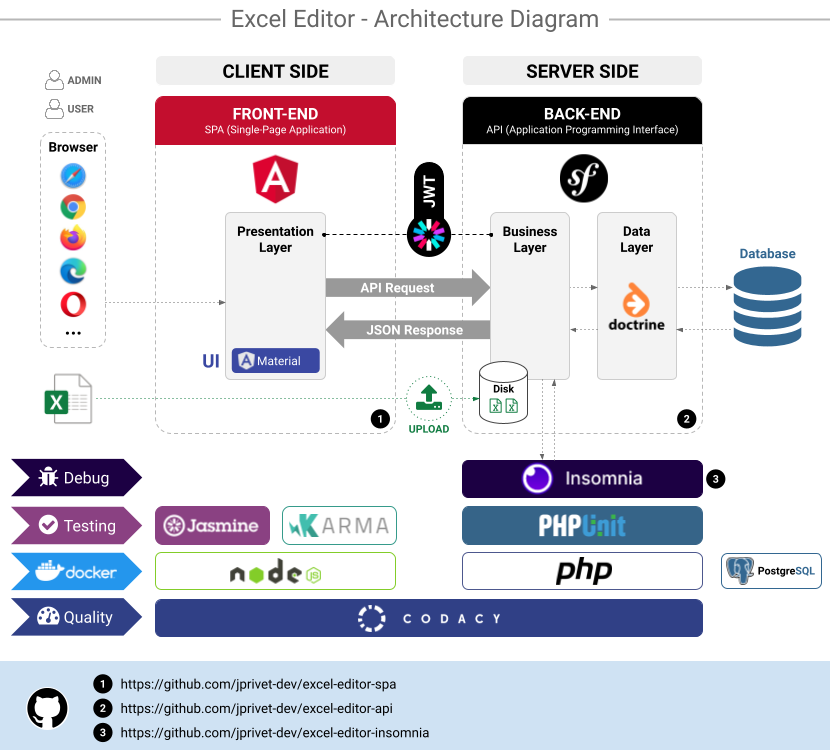

{back_to_top}

== Prerequisites

=== Docker Compose CLI

IMPORTANT: Be sure to install the latest version of https://docs.docker.com/compose/install/compose-plugin/[Docker Compose CLI plugin].

{back_to_top}

== Installation

=== To the very first cloning of the project

[NOTE]
====
With {git_url_api}[Excel Editor API], you can use...

* {git_url_spa}[Excel Editor SPA]: a front-end application made with https://angular.io/[Angular].
* {git_url_insomnia}[Excel Editor Insomnia]: the configuration to test the API with https://insomnia.rest/[Insomnia].
====

. `$ git clone {git_ssh_current}`.
. `$ cd {git_project_current}`.
. `$ make install`: This command will execute the following commands:
** `$ make build`: Build or rebuild fresh images if necessary.
** `$ make detach`: Create and start containers in detached mode (no logs).
** `$ make generate_keypair`: Generate the SSL keys for the JWT authentication.
** `$ make fixtures`: Create an admin & an user profils.
** `$ make logs`: Show live logs.
. Open your browser on https://localhost/api/doc and https://stackoverflow.com/a/15076602/1352334[accept the auto-generated TLS certificate].

image::doc/img/nelmio-api-doc.png[]

{back_to_top}

=== The following times

. Just launch the project with `$ make start` command.
. Open your browser on https://localhost/api/doc.

[TIP]
====
* `$ make stop`: Stop and remove containers, networks (alias: `$ make down`).
* `$ make`: See all available make commands.
====

{back_to_top}

== Upload Excel files

The Excel files are uploaded and renamed (with a unique indentifier) in the `uploads` folder.

TIP: You can test and upload the Excel files in the {git_url_api_data}[data] folder.

To purge the `uploads` folder: `$ rm uploads/*.xlsx`.

{back_to_top}

== Main technical constraints for the study

* Use of the latest version of https://symfony.com/[Symfony].
* No https://api-platform.com/[API Platform] or http://jmsyst.com/libs/serializer[JMSSerializer]: the objective is to study in depth https://symfony.com/doc/current/components/serializer.html[the Serializer Component].
* Use mainly the code generation commands (https://symfony.com/bundles/SymfonyMakerBundle/current/index.html[Symfony MakerBundle]).
* The project must be dockerized (https://github.com/dunglas/symfony-docker[Symfony Docker]).
* The project must have a consistent and correct code coverage.

{back_to_top}

// TODO: disable for the moment. To reactivate.
//== Docker environments
//
//When you run `$ docker compose up` it reads the overrides automatically (`docker-compose.yml` and `docker-compose.override.yml`).
//
//To deploy with this production Compose file you can run:
//
//```
//$  docker compose -f docker-compose.yml -f docker-compose.prod.yml up -d
//```
//
//{back_to_top}

== API documentation with Nelmio

NOTE: This project use https://github.com/nelmio/NelmioApiDocBundle

Open https://localhost/api/doc to see the API documentation.

{back_to_top}

== Style Guide

=== JSON naming convention

[NOTE]
====
* https://stackoverflow.com/questions/5543490/json-naming-convention-snake-case-camelcase-or-pascalcase
* https://google.github.io/styleguide/jsoncstyleguide.xml?showone=Property_Name_Format#Property_Name_Format
====

That project (API & SPA) use the `camelCase` format for the property names of JSON responses:

```
{
  "thisPropertyIsAnIdentifier": "identifier value"
}
```

{back_to_top}

=== Exceptions: return errors into JSON format

[NOTE]
====
* https://symfony.com/doc/current/controller/error_pages.html#working-with-the-kernel-exception-event
* https://symfony.com/doc/current/event_dispatcher.html#creating-an-event-listener
* https://symfonycasts.com/screencast/deep-dive/flatten-exception
* https://openclassrooms.com/fr/courses/7709361-construisez-une-api-rest-avec-symfony/7795134-gerez-les-erreurs-et-ajoutez-la-validation
====

In this project, *I will not use a listener or subscriber to force all errors into JSON format*.
As for example with the following subscriber:

```php
namespace App\EventSubscriber;

use Symfony\Component\ErrorHandler\Exception\FlattenException;
use Symfony\Component\EventDispatcher\EventSubscriberInterface;
use Symfony\Component\HttpFoundation\JsonResponse;
use Symfony\Component\HttpFoundation\Response;
use Symfony\Component\HttpKernel\Event\ExceptionEvent;
use Symfony\Component\HttpKernel\Exception\HttpExceptionInterface;
use Symfony\Component\HttpKernel\KernelEvents;
use Symfony\Component\Serializer\SerializerInterface;

class ExceptionSubscriber implements EventSubscriberInterface
{
    public function __construct(private SerializerInterface $serializer)
    {
    }

    public function onKernelException(ExceptionEvent $event): void
    {
        $response = new JsonResponse();

        $exception = $event->getThrowable();
        $flattenException = FlattenException::createFromThrowable($exception);
        $data = $this->serializer->normalize($flattenException);
        $response->setData($data);

        // HttpExceptionInterface is a special type of exception that
        // holds status code and header details
        if ($exception instanceof HttpExceptionInterface) {
            $response->setStatusCode($exception->getStatusCode());
            $response->headers->replace($exception->getHeaders());
        } else {
            $response->setStatusCode(Response::HTTP_INTERNAL_SERVER_ERROR);
        }

        $event->setResponse($response);
    }

    public static function getSubscribedEvents(): array
    {
        return [
            KernelEvents::EXCEPTION => 'onKernelException',
        ];
    }
}
```

Instead, I'll let the user choose the format of the response (HTML, JSON, XML or other) by properly using the `Accept` header request:

```
$ curl https://localhost/api/data --header 'Accept: application/json'
```

In the `SerializerErrorRenderer::render()` of Symfony, a `FlattenException` is created from the exception and is passed to the serializer, with the format from the request. `Accept: application/json` change the "preferred format" on the request to JSON.

TIP: In addition, the JSON error will be automatically filled in depending on the environment (dev or prod).

{back_to_top}

== PHPStorm configuration

IMPORTANT: The following configuration are provided for *PHPStorm 2022.3.2*

{back_to_top}

=== Docker Compose-based remote PHP interpreter

. Go on  *Settings (Ctrl+Alt+S) > PHP*.
. In the *PHP Settings* dialog, click on the Browse button kbd:[...] next to the *CLI Interpreter* list.
. In the *CLI Interpreters* dialog that opens, click on kbd:[+] and select "From Docker, Vagrant, VM, WSL, Remote...".
+
image::doc/img/phpstorm-2022.3.2-settings-php-select-cli-interpreter.png[]
. In the *Configure Remote PHP Interpreter* dialog that opens, select "Docker" :
** *Server:* Docker
** *Image name:* excel-editor-api-php:latest
** *PHP interpreter path:* php
** And click on the button kbd:[OK].
+
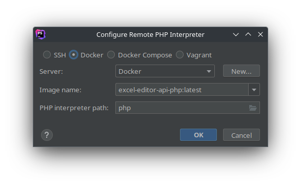
. In the *CLI Interpreters* dialog, click on the button kbd:[OK].
+
image::doc/img/phpstorm-2022.3.2-settings-php-cli-interpreters.png[]
. In the *Settings* dialog, click on kbd:[OK] or kbd:[Apply] to validate all.

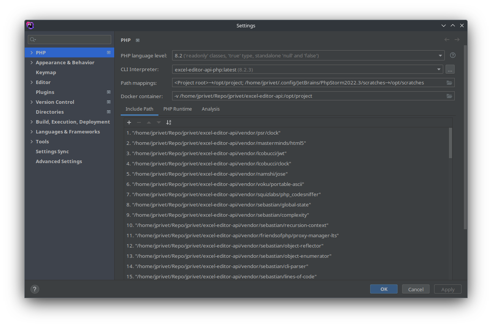

[IMPORTANT]
====
I have a new problem, with PHPStorm 2023.3.1 and 2023.3.2, I did not have on my previous computer: after the configuration, *PHP_CodeSniffer* & *PHP Mess Detector* do not work with the *Remote PHP Interpreter*.

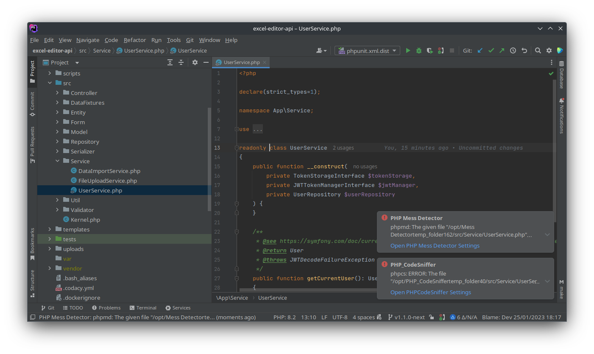

Search for a solution in progress...
====

{back_to_top}

=== PHP_CodeSniffer script associated with a PHP interpreter

==== Configuration

NOTE: See https://www.jetbrains.com/help/phpstorm/using-php-code-sniffer.html#configure-php-code-sniffer-script-associated-with-php-interpreter

. Go on  *Settings (Ctrl+Alt+S) > PHP > Quality Tools*.
. Expand the *PHP_CodeSniffer* area and switch kbd:[ON] the tool.
. In *Configuration*, choose *By default project interpreter*.
. In *Coding standard*, select kbd:[Custom] and choose the `phpcs.xml` file of this repository.
. After the configuration of *PHP_CodeSniffer*, *PHPStorm* will highlight the problematic lines in the files and can run *PHP CS fixer*.
. In the *Settings* dialog, click on kbd:[OK] or kbd:[Apply] to validate all.

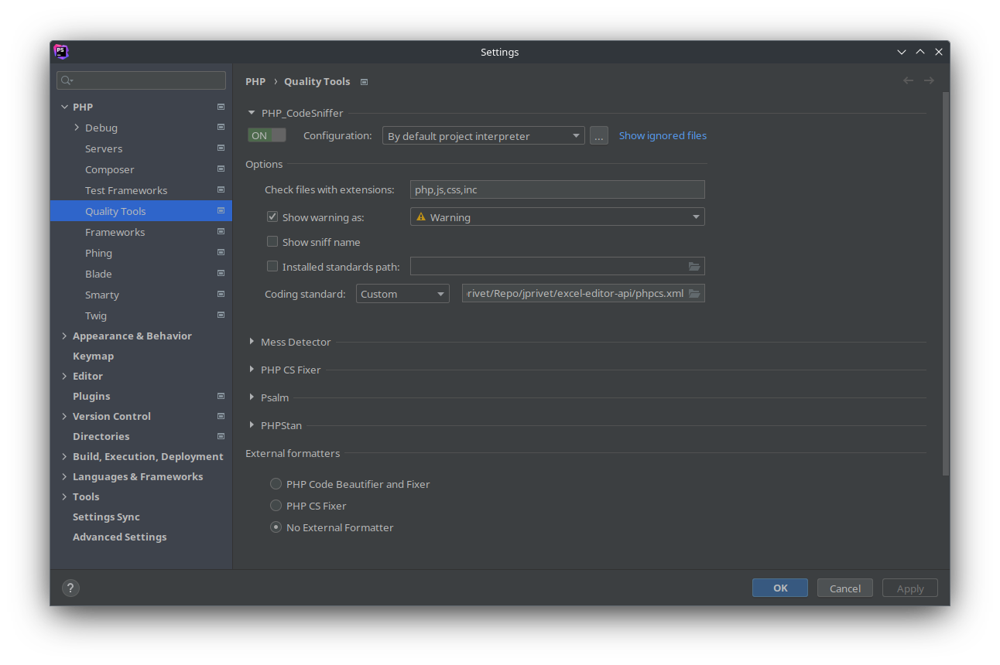

{back_to_top}

==== How is it installed?

NOTE: See https://github.com/squizlabs/PHP_CodeSniffer

Include a dependency for `squizlabs/php_codesniffer` in the `composer.json` file:

```json
{
    "require-dev": {
        "squizlabs/php_codesniffer": "3.*"
    }
}
```

And update all:

```
$ make composer c=update    # with Makefile
# OR
$ composer update           # with .bash_aliases
```

{back_to_top}

=== PHP Mess Detector script associated with a PHP interpreter

==== Configuration

NOTE: See https://www.jetbrains.com/help/phpstorm/using-php-mess-detector.html#configure-a-php-mess-detector-script-associated-with-a-php-interpreter

. Go on  *Settings (Ctrl+Alt+S) > PHP > Quality Tools*.
. Expand the *PHP Mess Detector* area and switch kbd:[ON] the tool.
. In *Configuration*, choose *By default project interpreter*.
. In *Custom rulesets*, click on kbd:[+] and choose the `phpmd.xml` file of this repository.
. In the *Settings* dialog, click on kbd:[OK] or kbd:[Apply] to validate all.

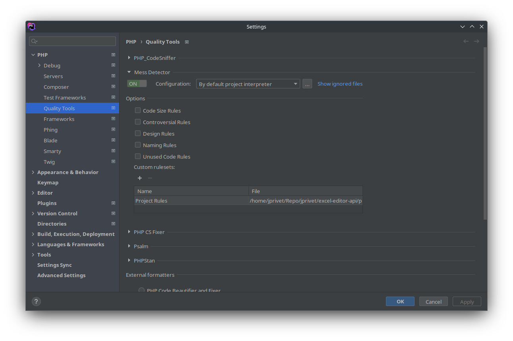

{back_to_top}

==== How is it installed?

NOTE: See https://packagist.org/packages/phpmd/phpmd

```
$ composer require --dev phpmd/phpmd
```

=== PHP Unit associated with a PHP interpreter

==== Configuration

NOTE: See https://www.jetbrains.com/help/phpstorm/using-phpunit-framework.html#configure-phpunit-manually

. Go on  *Settings (Ctrl+Alt+S) > PHP > Test Frameworks*.
. Click on kbd:[+] and select *PHPUnit by Remote Interpreter*.
+
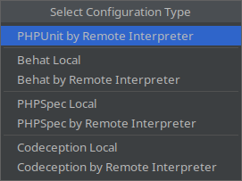
. In *PHPUnit by Remote Interpreter*, select *excel-editor-api-php:latest* and click on kbd:[OK].
+
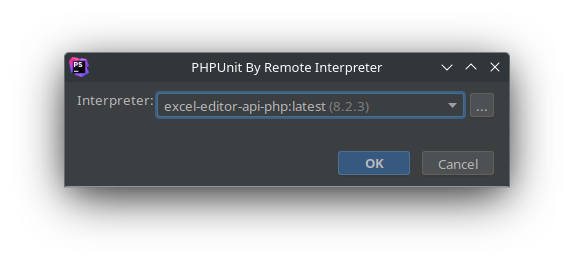
. In the *Settings* dialog, click on kbd:[OK] or kbd:[Apply] to validate all.

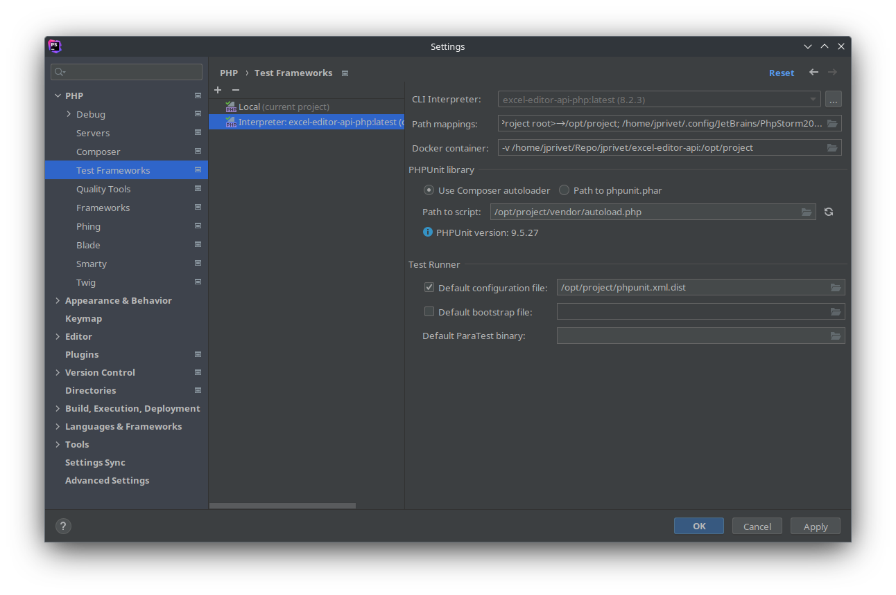

==== Run PHPUnit tests

For example, in the *Project* tool window, select the file or folder to run your tests from and choose *Run '<file or folder>'* from the context menu of the selection:

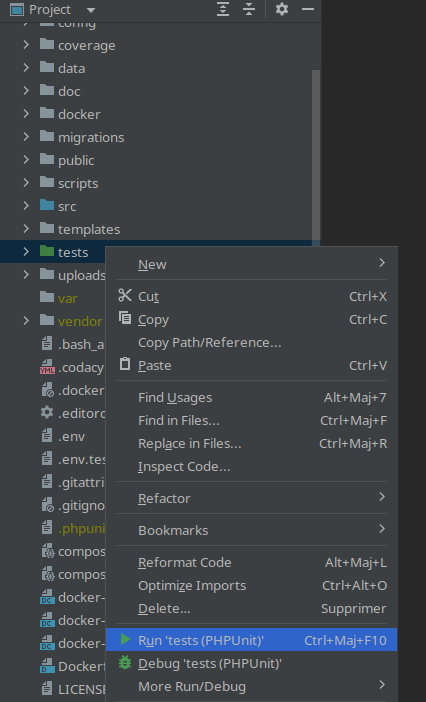

PhpStorm generates a default run configuration and starts a run test session with it:

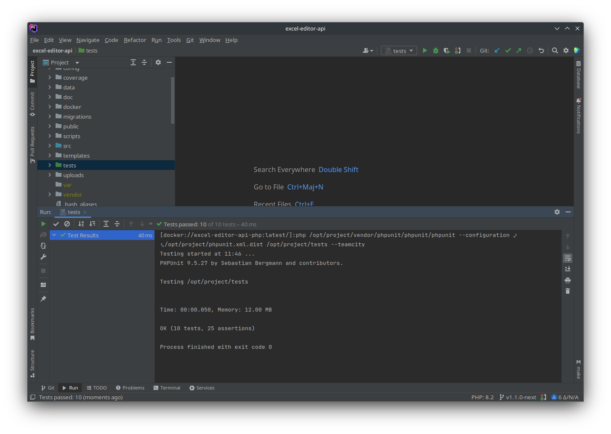

NOTE: More information on https://www.jetbrains.com/help/phpstorm/using-phpunit-framework.html#run_phpunit_tests

{back_to_top}

== Codacy configuration

=== Code coverage

[NOTE]
====
* https://github.com/codacy/codacy-coverage-reporter
* https://github.com/karma-runner/karma-coverage
====

TIP: Set `XDEBUG_MODE=coverage` before starting the container (see https://github.com/dunglas/symfony-docker/blob/main/docs/xdebug.md).

Duplicate `CODACY_PROJECT_TOKEN.sh`:

```
$ cp scripts/CODACY_PROJECT_TOKEN.sh.dist scripts/CODACY_PROJECT_TOKEN.sh
```

And define the API token `CODACY_PROJECT_TOKEN` (see {codacy_project_settings_coverage}).

The file `scripts/CODACY_PROJECT_TOKEN.sh` is ignored by *Git* and imported by `scripts/reporter.sh`.

The file `scripts/reporter.sh` generates code coverage (a `clover.xml` file with *PHPUnit*) and uploads the coverage reports on *Codacy*.

{back_to_top}

== Troubleshooting

=== Docker Compose CLI

Be sure to install the latest version of https://docs.docker.com/compose/install/compose-plugin/[Docker Compose CLI plugin].
With the older generation of docker compose, I had encountered the following error:

```
$ docker-compose build --pull --no-cache
...
Status: Downloaded newer image for composer:2
 ---> daa583eddaba
Step 27/31 : COPY composer.* symfony.* ./
COPY failed: no source files were specified
ERROR: Service 'php' failed to build : Build failed
```

Problem solved with the latest generation:

```
$ docker compose build --pull --no-cache
```

{back_to_top}

== Resources & Inspiration

* Dockerization of the project: https://github.com/dunglas/symfony-docker.
* Symfony documentation: https://symfony.com/doc/current/index.html
* Build a REST API with Symfony: https://openclassrooms.com/fr/courses/7709361-construisez-une-api-rest-avec-symfony
* Richardson Maturity Model: https://martinfowler.com/articles/richardsonMaturityModel.html
* Building Restful APIs with Symfony 5 and PHP 8: https://dev.to/hantsy_26/-building-restful-apis-with-symfony-5-and-php-8-1p2e

{back_to_top}

== Comments, suggestions?

Feel free to make comments/suggestions to me in the {git_url_current}/issues[Git issues section].

{back_to_top}

== License

"{main_title}" is released under the {git_url_current}/blob/main/LICENSE[*MIT License*]

---

{back_to_top}
